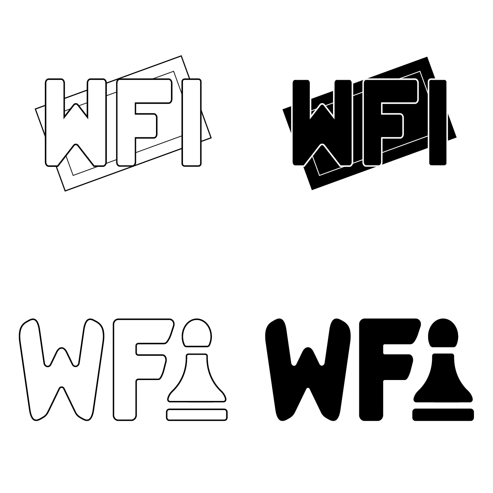
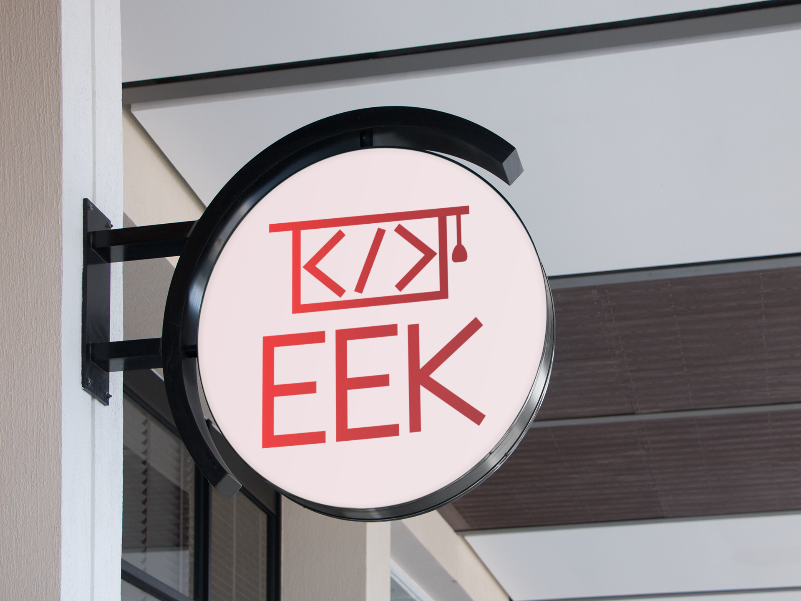
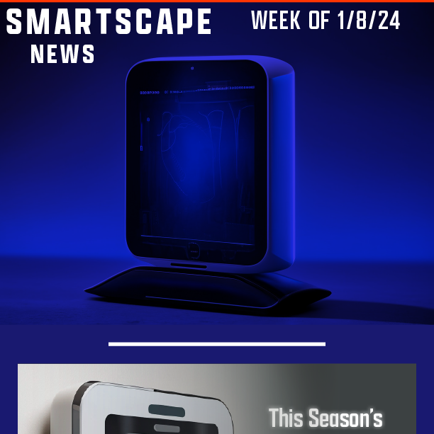
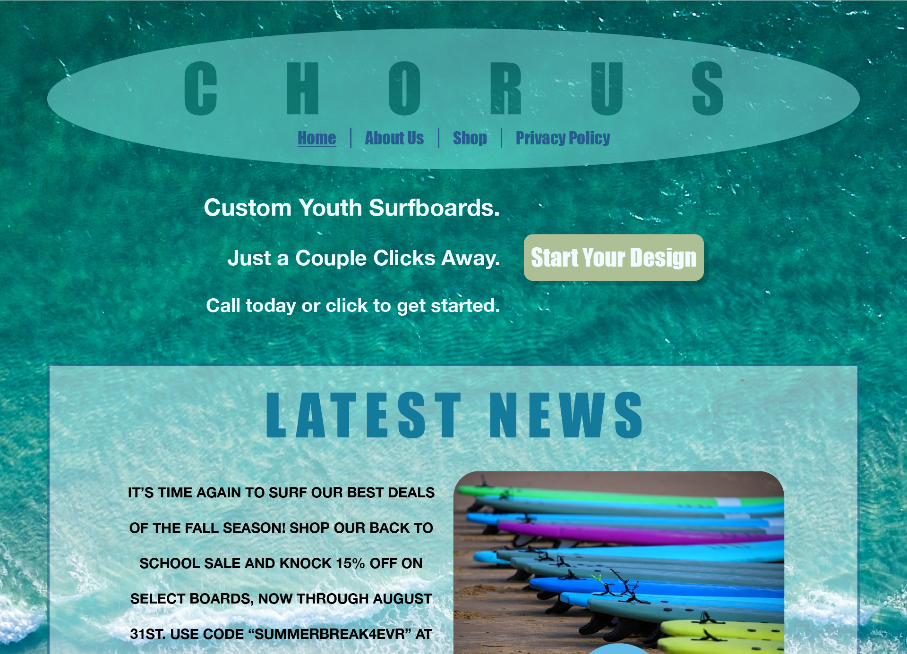
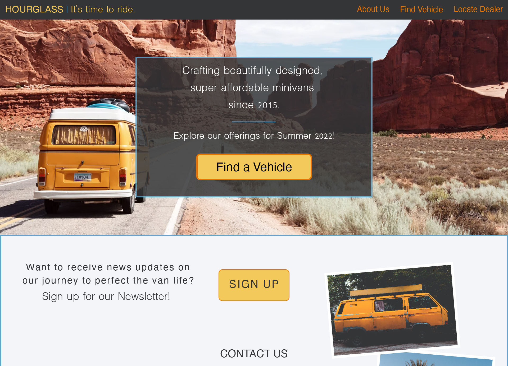

<h1 style="font-size: 20px" align="center"><a id="TOP">✍🏻 <a href="https://github.com/RachelMHoffman#AI">Illustrator</a> &nbsp; ✉️ <a href="https://github.com/RachelMHoffman#AID">InDesign</a> &nbsp; 💻 <a href="https://github.com/RachelMHoffman#AXD">XD</a> &nbsp; { } <a href="https://github.com/RachelMHoffman#HTMLCSS">HTML & CSS</a></a></h1>

<h2 style="font-size: 18px"><a id="AI">Logo Designs</a></h2>

<table align="center">
  <tr>
    <td align="center" width="350">
      
    </td>
    <td align="center" width="350">
      
    </td>
  </tr>
  <tr>
    <td>
      
<i>Western Flash</i>

      
Board Game Company Logo

      
2022

    </td>
    <td>
      
<i>EEK</i>

      
Coding Education Company Logo

      
2022

    </td>
  </tr>
</table>

<h2 style="font-size: 18px"><a id="AID">Email Newsletter Designs</a></h2>

<table align="center">
  <tr>
    <td align="center" width="300">
      
    </td>
    <td align="center" width="300">
      
    </td>
  </tr>
  <tr>
    <td>
      
<i>SmartScape</i>

      
Smart Home Technology Company's Subscriber Email Newsletter

      
2024

    </td>
    <td>
      
<i>XYZ Ventures</i>

      
Business Productivity Software Company's Employee Email Newsletter

      
2023

    </td>
  </tr>
</table>

<h2 style="font-size: 18px"><a id="AXD">Interface Wireframe Designs</a></h2>

(In process of moving over projects from old portfolio site)

<table align="center">
  <tr>
    <td align="center" width="500">
      
    </td>
    <td align="center" width="500">
      
    </td>
  </tr>
  <tr>
    <td>
      
<i></i>

      

      

    </td>
    <td>
      
<i></i>

      

      

    </td>
  </tr>
  <tr>
    <td align="center" width="500">
      
    </td>
    <td align="center" width="500">
      
    </td>
  </tr>
  <tr>
    <td>
      
<i>Chorus</i>

      
Surfboard Retail Company Website

      
2022

    </td>
    <td>
      
<i>Hourglass</i>

      
Minivan Retail Company Website

      
2022

    </td>
  </tr>
</table>

<h2 style="font-size: 18px"><a id="HTMLCSS">Coding Projects</a></h2>

(In process of updating and improving upon projects)

<table align="center">
  <tr>
    <td align="center" width="500">
      
    </td>
    <td align="center" width="500">
      
    </td>
  </tr>
  <tr>
    <td>
      
<i></i>

      

      

    </td>
    <td>
      
<i></i>

      

      

    </td>
  </tr>
</table>

<h3 style="font-size: 16px" align="center"><a href="https://github.com/RachelMHoffman#TOP">Back to Top</a>&nbsp;⬆️</h3>
