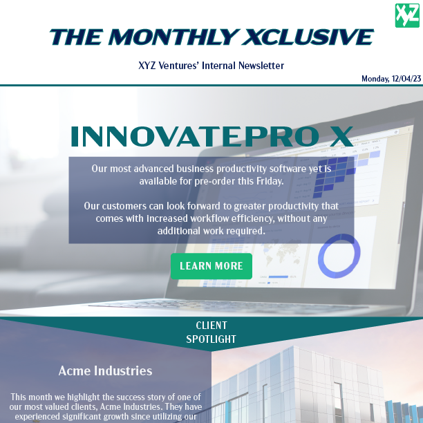

<h1 style="font-size: 20px">Welcome, friends! 👋🏻 </h1>

You've reached my portfolio. I feel a great sense of accomplishment from creating stellar marketing materials through graphic designing, writing, and any supplemental tasks to be done to convey the message an organization aims to get across. Feel free to browse my current example projects made over the past few years below by section: Illustrator, InDesign, XD, and HTML & CSS.

<h2 style="font-size: 18px">✍🏻 Adobe Illustrator Projects</h2>

<table align="center">
  <tr>
    <td align="center" width="300">
      
    </td>
    <td align="center" width="300">
      
    </td>
  </tr>
  <tr>
    <td>
      
<i>Western Flash</i>

      
Board Game Company Logo

      
2022

    </td>
    <td>
      
<i>EEK</i>

      
Coding Education Company Logo

      
2022

    </td>
  </tr>
</table>

<h2 style="font-size: 18px">✉️ Adobe InDesign Projects</h2>

<table align="center">
  <tr>
    <td align="center" width="300">
      
    </td>
    <td align="center" width="300">
      
    </td>
  </tr>
  <tr>
    <td>
      
<i>SmartScape</i>

      
Smart Home Technology Company's Subscriber Email Newsletter

      
2024

    </td>
    <td>
      
<i>XYZ Ventures</i>

      
Business Productivity Software Company's Employee Email Newsletter

      
2023

    </td>
  </tr>
</table>

<h2 style="font-size: 18px">💻 Adobe XD Projects</h2>

(In process of moving over projects from old portfolio site)

<table align="center">
  <tr>
    <td align="center" width="300">
      
    </td>
    <td align="center" width="300">
      
    </td>
  </tr>
  <tr>
    <td>
      
<i></i>

      

      

    </td>
    <td>
      
<i></i>

      

      

    </td>
  </tr>
  <tr>
    <td align="center" width="300">
      
    </td>
    <td align="center" width="300">
      
    </td>
  </tr>
  <tr>
    <td>
      
<i></i>

      

      

    </td>
    <td>
      
<i></i>

      

      

    </td>
  </tr>
</table>

<h2 style="font-size: 18px">{ } HTML + CSS Coding Projects</h2>

(In process of updating and improving upon projects)

<table align="center">
  <tr>
    <td align="center" width="300">
      
    </td>
    <td align="center" width="300">
      
    </td>
  </tr>
  <tr>
    <td>
      
<i></i>

      

      

    </td>
    <td>
      
<i></i>

      

      

    </td>
  </tr>
</table>
